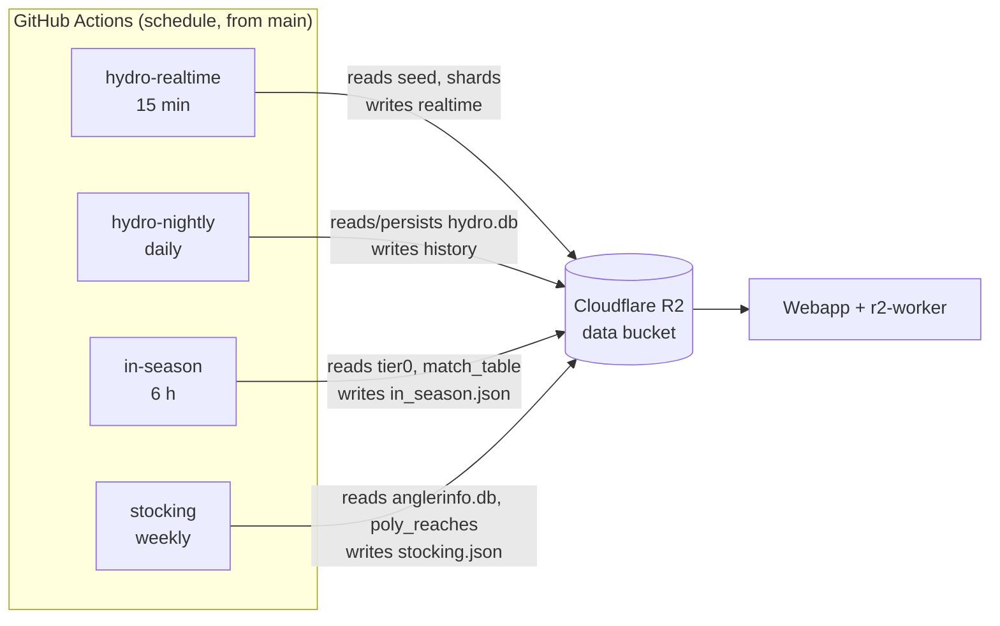
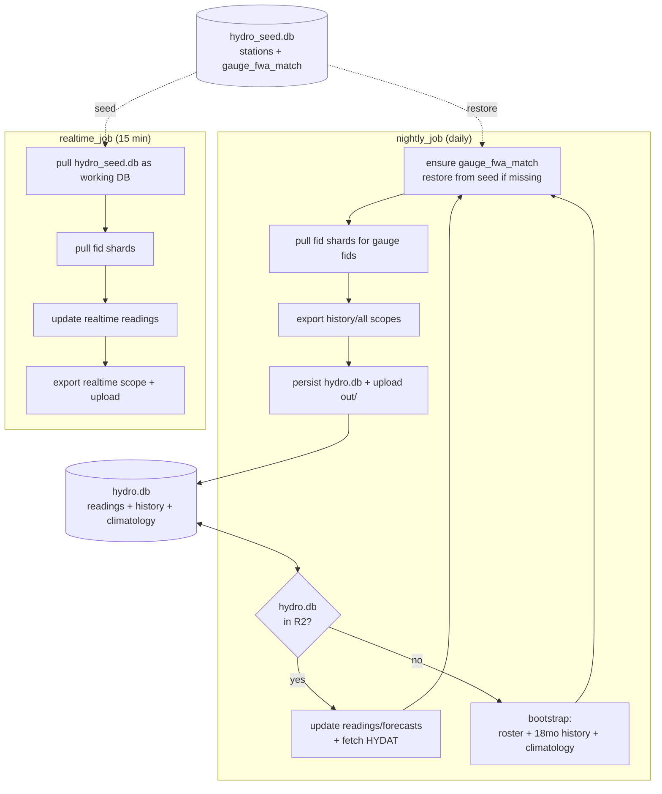
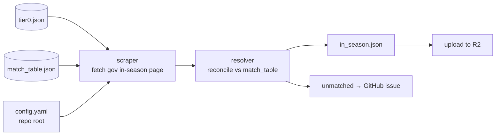
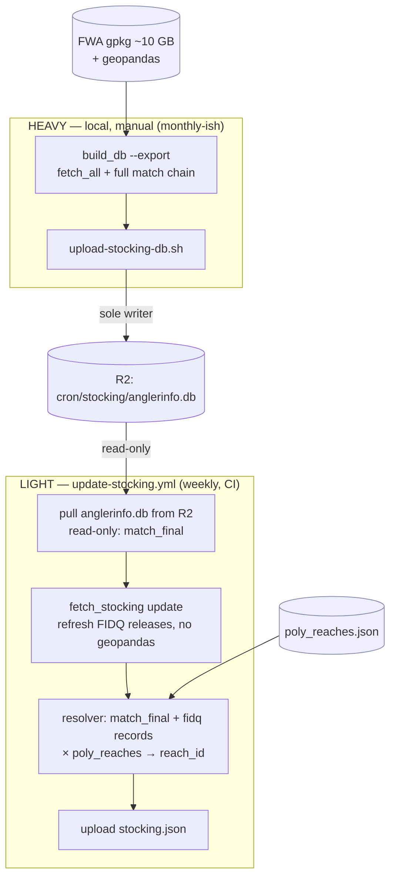

# Cron Data Flow

How the scheduled jobs keep the live site's data fresh, what each one needs,
and why. All crons are **GitHub Actions** scheduled workflows (they run from the
**default branch**, `main`). They read/write **Cloudflare R2** via the shared
S3/boto3 helper (`pipeline.recurring.r2_storage`); the webapp/worker serve those
R2 objects.

## The crons at a glance

| Workflow | Schedule | Writes to R2 | Purpose |
|---|---|---|---|
| `update-hydro-realtime` | every 15 min | `cron/hydro/*` (realtime scope) | Latest gauge readings/forecasts |
| `update-hydro-nightly` | daily 09:00 UTC | `cron/hydro/hydro.db`, `cron/hydro/*` | 18-mo history + HYDAT climatology; persists the DB |
| `update-in-season` | every 6 h | `in_season.json` | In-season regulation changes (closures/openings) |
| `update-stocking` | weekly (Mon 09:00 UTC) | `cron/stocking/stocking.json` (+ legacy) | FIDQ fish-stocking releases → reach IDs |

**Deploy env** is chosen per run: `main` → production bucket
(`bc-fishing-regulations`), any other branch → staging
(`bc-fishing-regulations-staging`).

**Required secrets** (repo-level): `R2_ACCESS_KEY_ID`, `R2_SECRET_ACCESS_KEY`,
`CLOUDFLARE_ACCOUNT_ID`. Without them the jobs run but fail at R2 I/O.



## Why R2 is the source of truth in CI

GitHub Actions runners are ephemeral and have **no pipeline output** — the full
regulations build (tiles, `tier0.json`, `poly_reaches.json`, the 66 MB
`anglerinfo.db`, the ~10 GB FWA GeoPackage) is far too big/slow to rebuild each
run. So every cron **pulls the inputs it needs from R2**, does a light
transform, and **pushes the result back**. The heavy build happens elsewhere
(locally / the full pipeline) and seeds R2.

---

## Hydro (realtime + nightly)

Two jobs share one persisted database, `cron/hydro/hydro.db`, plus a small
`cron/hydro/hydro_seed.db` (station roster + `gauge_fwa_match`) built by the
enrichment pipeline.



**What each needs & why**

- **`hydro_seed.db`** — carries `gauge_fwa_match` (gauge → FWA `fwa_id`, 462 rows)
  and the station roster. Built at enrich time by `match_fwa` (atlas-time,
  geopandas). The realtime job uses it directly as its working DB.
- **fid shards** (`shards/v{N}/fids/{prefix}.json`) — only the buckets the gauge
  fids fall into are pulled, so the exporter can resolve gauge `reach_id`s
  without the full shard set.
- **Nightly `gauge_fwa_match` restore** — `bootstrap`/`update` build a DB that
  has *no* `gauge_fwa_match` (that table is atlas-time only). Nightly therefore
  restores it from `hydro_seed.db` before pulling shards; `_gauge_fids` also
  guards the table's absence so a seedless run degrades instead of crashing.

---

## In-season regulation changes



- Pulls `tier0.json` + `match_table.json` from R2 (its reconciliation inputs).
- Reads defaults from **`config.yaml` at the repo root** (resolved via
  `parents[3]` from `pipeline/recurring/in_season/…`).
- Deps: `requests beautifulsoup4 pyyaml python-dotenv boto3`.
- Any regulation it can't reconcile is filed as a GitHub issue by the workflow.

---

## Stocking — two-tier

All stocking state lives in `anglerinfo.db`. Refreshing it fully needs geopandas
and the ~10 GB FWA GeoPackage, so it is split into a **light CI tier** and a
**heavy manual tier**. R2's `cron/stocking/anglerinfo.db` is the shared state.



**Why two tiers**

| | Light (weekly CI) | Heavy (manual, local) |
|---|---|---|
| Runs | `fetch_stocking` + resolver | full `build_db` (fetch_all + match chain) |
| Needs | `anglerinfo.db` (R2), `poly_reaches.json` | geopandas, ~10 GB FWA gpkg, gov WFS |
| Surfaces | **new releases** for already-matched waterbodies | **new waterbodies** (new `match_final` rows) |
| Writes db to R2? | **No** (read-only — avoids racing heavy) | **Yes** (sole writer) |

- `waterbody_id` is FIDQ's **stable** `TEXT PRIMARY KEY`, so `match_final.source_id`
  stays valid across light-tier `fetch_stocking` refreshes — the light job can
  refresh releases without invalidating the heavy job's matches.
- The resolver maps each waterbody's `waterbody_key` → `reach_id` via
  `poly_reaches.json`, which only changes on a full regulations build.

**Heavy-tier run (local):**

```bash
python -m pipeline.recurring.anglerinfo.build_db --export   # rebuild db (heavy)
DEPLOY_ENV=production ./scripts/upload-stocking-db.sh        # publish db to R2
```

---

## Limitations (today)

The current design optimises for "cheap to run on free GitHub Actions + R2" and
accepts real trade-offs to get there:

1. **R2 blobs are the database.** State lives in whole-file sqlite DBs / JSON in
   R2 that crons pull → mutate → push. There are no transactions and no
   incremental updates — every run rewrites whole objects. Correctness against
   concurrency relies on workflow `concurrency:` groups plus conventions (the
   stocking light job is read-only; hydro's version.json is written last).
2. **New stocking waterbodies need a human.** The heavy match chain needs
   geopandas + the ~10 GB FWA GeoPackage + gov WFS, which can't run on a CI
   runner, so it's a manual local job (`build_db` → `upload-stocking-db.sh`).
   Until someone runs it, genuinely new waterbodies never appear — a staleness
   and bus-factor risk.
3. **Fragile hydro seed coupling.** `bootstrap`/`update` build a hydro DB with no
   `gauge_fwa_match`; we patch it by restoring that table from `hydro_seed.db`.
   That seed must exist and be current, and gauge→FWA matches only refresh at
   full-atlas build time — not on any cron.
4. **Reach mappings aren't a cron.** `poly_reaches.json` / `tier0.json` / tiles
   come from the full regulations build, which is manual. Stocking reach_ids and
   in-season reconciliation silently depend on that output being fresh.
5. **Weak cross-dataset versioning.** `data_version.json` is a single global
   marker; a partly-completed multi-file upload can briefly serve a mixed state.
   Only hydro uses a per-tree `version.json` fence.
6. **Schedule reliability.** GHA cron is best-effort (the 15-min realtime job is
   often delayed), schedules are disabled after 60 days of repo inactivity, and
   a newly-added workflow may skip its first tick.
7. **Thin observability.** Only in-season surfaces failures (it files a GitHub
   issue for unmatched regs). The others fail silently in the Actions UI — no
   alerting, metrics, or freshness dashboard.

## If rebuilt from scratch

Roughly in order of leverage:

- **Real datastore instead of sqlite-in-R2.** A Postgres/PostGIS (or DuckDB)
  source of truth would give transactions and *incremental* updates: crons
  UPSERT rows, exporters read. This removes the pull-whole-DB / push-whole-DB
  dance and most concurrency hazards.
- **Atomic, versioned snapshots.** Publish each build to a content-addressed or
  timestamped prefix and flip a single manifest pointer last, so clients never
  observe a partial update. Replaces the ad-hoc `data_version.json`.
- **Give the heavy anglerinfo build real compute.** A self-hosted runner /
  scheduled cloud VM / container with the FWA gpkg cached (or streamed from R2)
  would let new-waterbody matching run automatically instead of manually — and
  fold the two stocking tiers back into one scheduled flow.
- **Publish `gauge_fwa_match` as its own scheduled artifact** so hydro stops
  depending on an enrich-time seed and the bootstrap-restore hack goes away.
- **Make the regulations build schedulable/incremental** so `poly_reaches` /
  `tier0` refresh without a manual run — the thing every downstream cron leans on.
- **One orchestrator, not N independent scripts.** A small DAG (or a single
  workflow running ordered steps) with shared input caching removes the repeated
  "pull the same tier0/poly_reaches from R2" work and makes ordering explicit.
- **Uniform alerting + run summaries** for every cron (not just in-season), plus
  a simple freshness check per dataset.

## Adding / changing a cron — checklist

1. The workflow's `schedule:` only takes effect once it's on **`main`**.
2. Pull inputs from R2 (never assume pipeline output exists on the runner).
3. Keep CI light — no geopandas / multi-GB reference data. Push those to a
   manual/local tier that seeds R2.
4. Ensure the three R2/Cloudflare secrets are present.
5. Guard for optional tables/files so a missing input degrades, not crashes.
